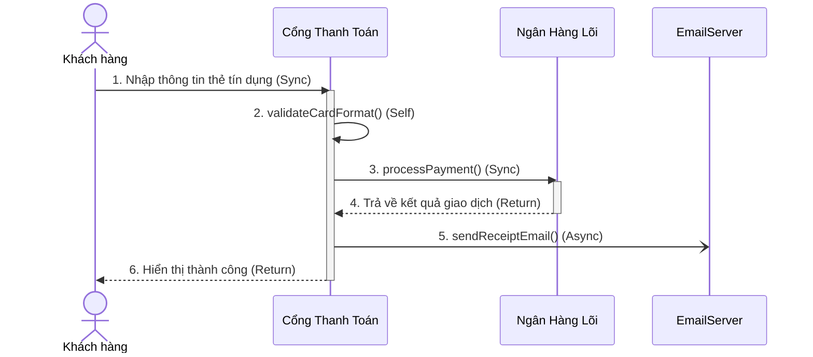

# BÁO CÁO PHÂN TÍCH LỖI VÀ KHẮC PHỤC THIẾT KẾ SƠ ĐỒ TUẦN TỰ CHỨC NĂNG THANH TOÁN RIKKEIBANK

> 👤 **Học viên:** Đỗ Hoàng Sơn | **Mã SV:** PTIT-HCM-066
> 🏫 **Môn học:** IT105-K25-Phan-tich-thi-t-k-h-th-ng

---

## 📊 Sơ đồ thiết kế hệ thống (Sequence Diagram)

> 💡 *Sơ đồ dưới đây được render tự động trực tiếp trên GitHub bằng Mermaid. Bạn cũng có thể tải file **`bt2.drawio`** trong repository này để mở và chỉnh sửa trực tiếp trên [Draw.io (diagrams.net)](https://app.diagrams.net).* 

---

## Nhiệm vụ 1: Tìm lỗi và giải thích nguyên nhân gây hại trong sơ đồ AS-IS

Sau khi rà soát kỹ lưỡng bản mô tả sơ đồ tuần tự do bạn thực tập sinh thiết kế, em đã phát hiện ra chính xác 2 lỗi nghiêm trọng về mặt logic nghiệp vụ và lựa chọn loại thông điệp UML. Những lỗi này nếu không được sửa đổi trước khi bàn giao cho đội ngũ lập trình (Dev) sẽ dẫn đến việc triển khai sai kiến trúc hệ thống, gây lãng phí tài nguyên và làm suy giảm nghiêm trọng trải nghiệm người dùng (UX).

| STT | Vị trí lỗi | Mô tả lỗi của Thực tập sinh | Hậu quả kỹ thuật & Nghiệp vụ | Giải pháp khắc phục (Loại đúng) |
| --- | --- | --- | --- | --- |
| 1 | Bước 2: Kiểm tra định dạng thẻ | Vẽ thông điệp Async gửi sang một Lifeline mới tự dựng (không có trong kịch bản gốc). | Việc tự ý dựng thêm một Lifeline mới chỉ để kiểm tra định dạng thẻ là sai nguyên tắc thiết kế hướng đối tượng. Hành động này làm phình to hệ thống một cách vô lý, gây hiểu lầm cho Dev rằng cần phải viết một service riêng biệt. Thực tế, đây chỉ là một hàm kiểm tra logic nội bộ (local validation) của Cổng Thanh Toán. | Sử dụng thông điệp Tự gọi (Self-call) với ký hiệu mũi tên vòng cung quay lại chính Lifeline 'Cổng Thanh Toán'. |
| 2 | Bước 6: Gửi email hóa đơn | Vẽ thông điệp Đồng bộ (Sync) kèm theo mũi tên phản hồi (Return) từ EmailServer. | Việc dùng Sync bắt Cổng Thanh Toán phải đứng chờ EmailServer phản hồi rồi mới đi tiếp. Nếu EmailServer bị nghẽn mạng, quá tải hoặc phản hồi chậm, luồng thanh toán của khách hàng sẽ bị treo (blocking). Khách hàng phải đợi email gửi xong mới thấy màn hình thành công, gây trải nghiệm cực kỳ tệ và có thể dẫn đến lỗi timeout giao dịch. | Sử dụng thông điệp Bất đồng bộ (Async) với ký hiệu mũi tên nét liền đầu hở và KHÔNG có mũi tên Return đi kèm. |

## Nhiệm vụ 2: Thiết kế lại sơ đồ tuần tự hoàn chỉnh (TO-BE)

Sơ đồ tuần tự TO-BE đã được tối ưu hóa hoàn toàn để giải quyết triệt để hai lỗi nêu trên. Quy trình mới đảm bảo tính toàn vẹn dữ liệu, tối ưu hóa hiệu năng hệ thống và nâng cao trải nghiệm người dùng.

Ở bước 2, hành động kiểm tra định dạng thẻ được thực hiện trực tiếp trên Cổng Thanh Toán thông qua một thông điệp Self-call 'validateCardFormat()'. Điều này giúp loại bỏ hoàn toàn Lifeline dư thừa.

Ở bước 5, ngay sau khi nhận được kết quả giao dịch thành công từ Ngân Hàng Lõi, Cổng Thanh Toán sẽ bắn một thông điệp Async 'sendReceiptEmail()' sang EmailServer và lập tức trả về kết quả thành công cho Khách hàng ở bước 6 mà không cần đợi EmailServer phản hồi. Luồng xử lý này giúp giảm thiểu tối đa thời gian phản hồi (Response Time) trên giao diện người dùng.

- Sử dụng ký hiệu mũi tên vòng cung cho thông điệp Self-call tại Cổng Thanh Toán.
- Sử dụng mũi tên nét liền đầu hở (Async) hướng sang EmailServer để thể hiện việc xử lý không đồng bộ.
- Đảm bảo activation bar của Ngân Hàng Lõi được khép lại chính xác bằng thông điệp Return nét đứt đầu hở trước khi thực hiện các bước tiếp theo.

## Nhiệm vụ 3: Đề xuất giải pháp kỹ thuật chi tiết cho đội ngũ Dev

Để đảm bảo đội ngũ lập trình triển khai đúng tinh thần của bản thiết kế TO-BE, em đề xuất các hướng dẫn kỹ thuật cụ thể như sau:

- Đối với hàm 'validateCardFormat()': Triển khai dưới dạng một private method trong class 'PaymentGateway'. Sử dụng các biểu thức chính quy (Regular Expression) để kiểm tra định dạng thẻ ngay tại local, tuyệt đối không gọi API ra ngoài ở bước này.
- Đối với cơ chế gửi email bất đồng bộ 'sendReceiptEmail()': Khuyến nghị sử dụng một hàng đợi tin nhắn (Message Queue) như RabbitMQ hoặc ActiveMQ. Cổng Thanh Toán chỉ cần push một message chứa thông tin hóa đơn vào queue (mất vài mili-giây) rồi đi tiếp. Một background worker của EmailServer sẽ subscribe queue này và thực hiện gửi email độc lập ở nền dưới.

---

## 📁 Danh sách tệp tin nộp bài trong Repository
- 📝 `bt2.docx`: Báo cáo tài liệu phân tích nghiệp vụ hoàn chỉnh.
- 🎨 `bt2.drawio`: File thiết kế sơ đồ chuẩn theo quy định đề bài (mở trực tiếp bằng [Draw.io](https://app.diagrams.net) hoặc Lucidchart).
